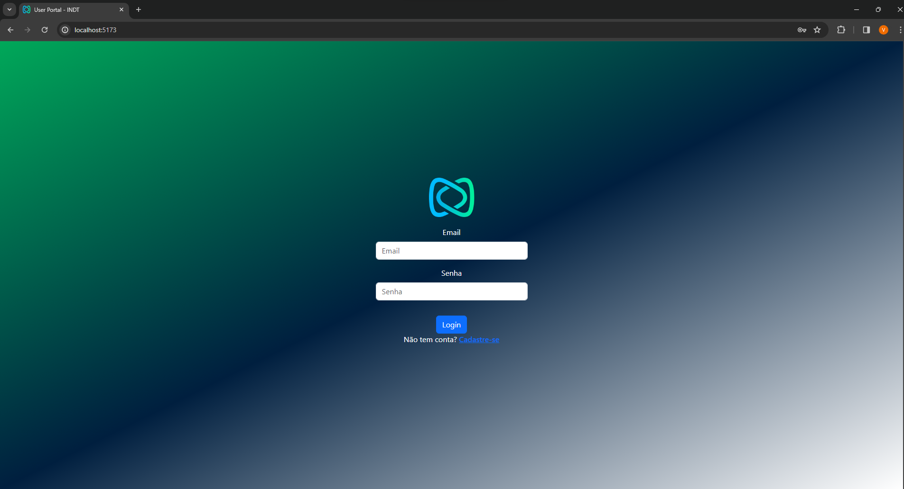
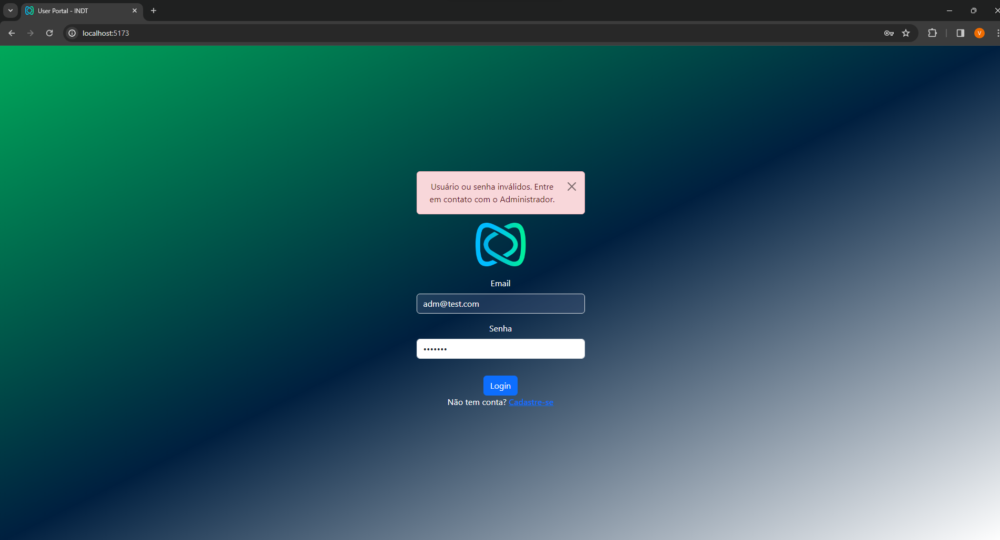
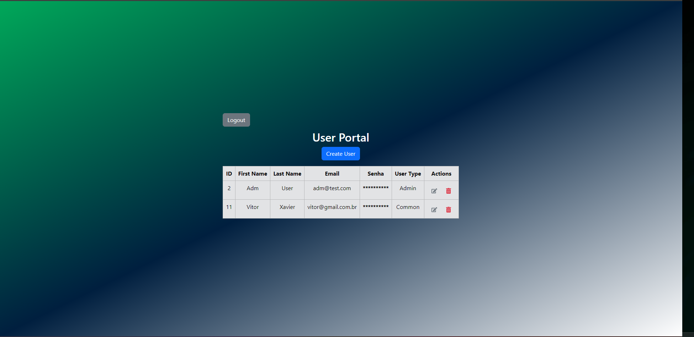
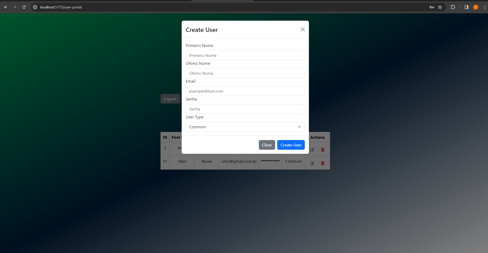
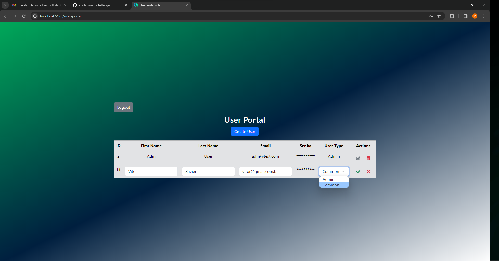
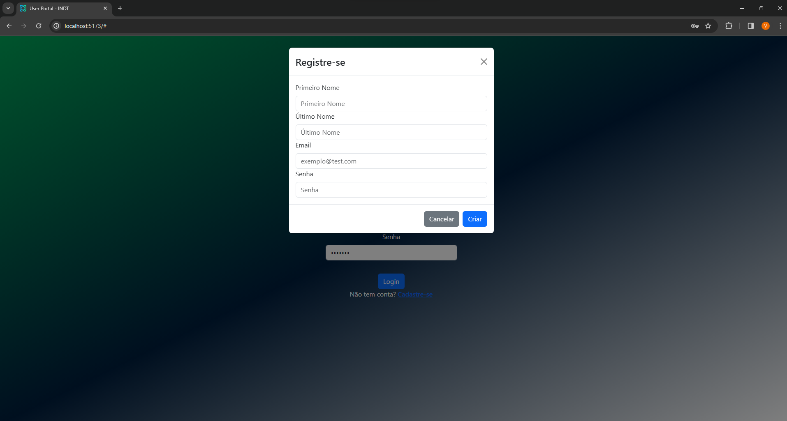
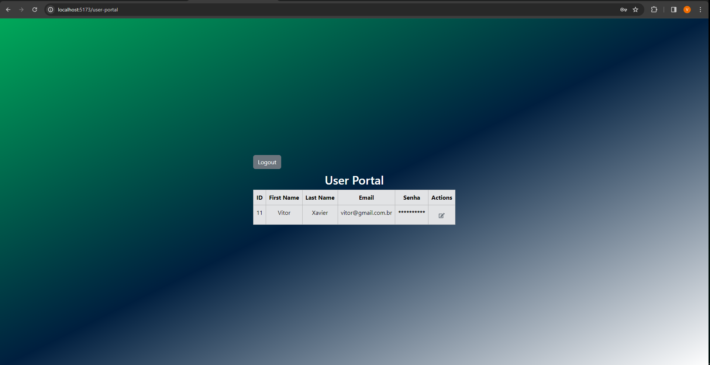
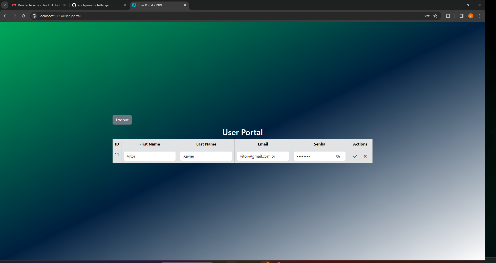
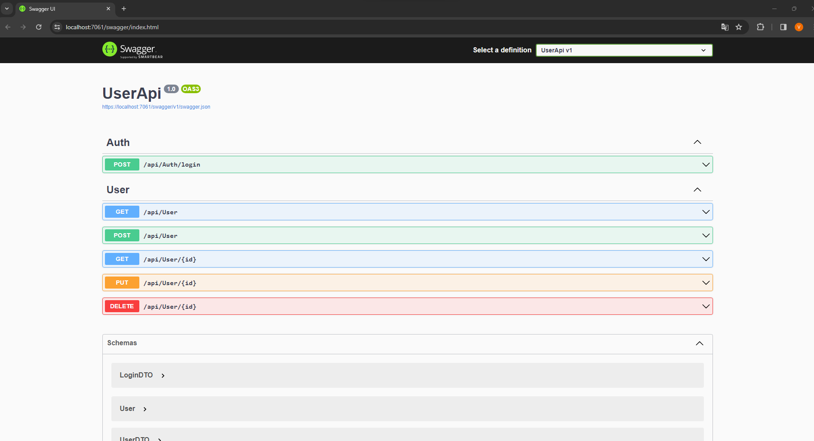

# DESAFIO TÉCNICO - DEV.FullStack - INDT

Implementar um sistema de gerenciamen to de usuário.

Este documento fornece instruções detalhadas para executar o backend e o frontend da solução sem Docker. Certifique-se de seguir todas as etapas para garantir uma execução bem-sucedida do aplicativo.

Primeiramente clone este repositório: https://github.com/vitohpx/indt-challenge.git

## Backend

### Pré-requisitos

Certifique-se de ter o seguinte instalado na sua máquina:

- [.NET SDK](https://dotnet.microsoft.com/download)
- [Node.js](https://nodejs.org/)
- [SQL Server](https://www.microsoft.com/sql-server/)

### Configuração do Banco de Dados

Passos para Executar Migração e Inicializar o Banco de Dados:

Atualize a string de conexão no arquivo `appsettings.json` no projeto `UserApi` com as informações do seu banco de dados.

   ```json
   "ConnectionStrings": {
       "DefaultConnection": "sua-string-de-conexao-aqui"
   }
  ```

Abra um terminal ou prompt de comando no diretório onde está localizado o projeto do backend (UserApi). Você pode navegar até esse diretório usando o comando cd no terminal.

```
cd UserApi
```
Criar uma Migração:

Execute o seguinte comando para criar uma nova migração:
```
dotnet ef migrations add NomeDaMigracao
```
Substitua NomeDaMigracao por um nome significativo que descreva a migração. Isso criará arquivos necessários para atualizar o banco de dados.

Aplicar Migrações:
Em seguida, execute o comando para aplicar as migrações:

```
dotnet ef database update
```
Este comando aplicará as migrações pendentes e configurará o banco de dados de acordo.

Certifique-se de que o banco de dados esteja acessível e que a conexão seja válida. Se necessário, ajuste a cadeia de conexão no arquivo appsettings.json.
### API
Crie um arquivo .env no projeto UserApi, assim como está no .env.example e adcione:
   
URL_FRONT=http://localhost:5173

Navegue até o diretório do projeto UserApi.

```
cd UserApi
```

Restaure as dependências e execute o aplicativo.

```
dotnet restore
```

```
dotnet run
```

O backend estará em execução em https://localhost:7061.


## Frontend

### Pré-requisitos
Certifique-se de ter o seguinte instalado na sua máquina:

- [Node.js](https://nodejs.org/en)

### Execução do Frontend

Navegue até o diretório do projeto frontend.


```
cd frontend
```

Crie um arquivo .env, assim como está no .env.example e adcione:
   
VITE_API_URL=https://localhost:7061/api

Instale as dependências.
```
npm install
```

Inicie o aplicativo frontend.
```
npm run dev
```

O frontend estará em execução em http://localhost:5173.

#### Observações

Certifique-se de que o backend está em execução antes de iniciar o frontend.
Se necessário, ajuste as configurações do banco de dados e outras configurações no arquivo appsettings.json no projeto UserApi.
Agora, você deve ter o aplicativo em execução com o backend na porta 7061 e o frontend na porta 5173. Acesse essas URLs em seu navegador para interagir com a aplicação.

Lembre-se de que essas instruções são uma orientação geral e podem precisar de ajustes com base nas configurações específicas do seu ambiente.


#### DIFERENCIAL:

Foi utilizado docker para criar a conteinerização do
back-end da solução, caso queira testar remova os comentários das linhas de 6 a 8 do  `appsettings.json` no projeto `UserApi`.

Certifique-se de ter o Docker instalado na sua máquina. Você pode baixá-lo [aqui](https://www.docker.com/products/docker-desktop).

Execute: docker compose up 

Teste os endpoints:
```
POST
/api/Auth/login
```
```
GET
/api/User

POST
/api/User

GET
/api/User/{id}

PUT
/api/User/{id}

DELETE
/api/User/{id}
```

Para experimentar toda a aplicação, siga os passo antes dessa etapa "DIFERENCIAL". 


### Sobre o SISTEMA

É um CRUD, no qual há dois tipos de usuários: Admin e Common.

O usuário ADMIN, pode tanto cadastrar um usuário quanto definir seu nível de acesso. Além disso, ele pode editar e visualizar dados de outros usuários (menos as senhas, a não ser sua própria), também pode deletar qualquer usuário. Um usuário ADMIN já é previamente cadastrado no sistema após a configuração e execução do banco de dados (migration e seed).

#### Login


#### Login - Falha 


#### Lista de usuário que o ADM tem acesso


#### Criação de usuário


#### Edição de usuário pelo ADM


Quando nos cadastramos logo na tela inicial de Login, somos usuário COMMON, esse usuário tem acesso aos seus dados, podendo editá-los ao entrar com sucesso no portal.

#### Registro no site


#### Usuário Common acessando o portal


#### Edição de dados do usuário Common



#### SWAGGER



